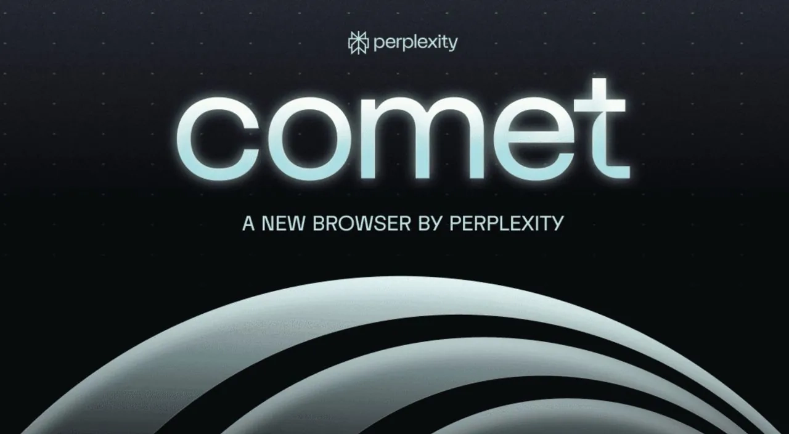

# Comet浏览器实测：Perplexity的AI承诺能兑现几分？

---

想象一下，你的浏览器不仅能帮你浏览网页，还能预判你的需求、自动完成任务，甚至帮你设计YouTube封面——而你只需要坐在那里，专注于真正重要的事。这听起来像科幻片？Perplexity推出的Comet浏览器就想做到这一点。它基于Chrome内核，融合了语音指令、个性化集成和购物助手等功能，号称要重新定义我们与互联网的交互方式。但问题来了：它真的能实现那些大胆的承诺，还是只是又一个"理想很丰满，现实很骨感"的案例？

这篇文章会带你看看Comet浏览器的真实表现——从AI驱动的自动化到创意工具，从语音识别的准确度到隐私问题的隐忧。如果你是个追求效率的多任务处理者，或者对AI接管浏览器持怀疑态度，这篇评测会给你一些实用的参考。

---

## 核心功能：听起来很美好

### AI自动化：能省事，但不够聪明

Comet浏览器最吸引人的地方，就是它能**自动化一些重复性任务**。比如：

- 自动把"Taco Tuesday"这种固定活动加到你的日历里
- 在Instacart上更新购物清单

听起来不错，对吧？但实际用起来，你会发现它只能处理简单的任务。一旦涉及复杂操作，它就开始"装傻"，需要你手动介入。这种"半自动化"的体验，让人觉得它还没到真正解放双手的程度。

### 语音指令：多任务时的好帮手

Comet支持**语音指令**，你可以通过说话来搜索信息或管理日程。这对于需要同时处理多件事的人来说挺实用——比如你在做饭时想查个菜谱，或者开车时想记个备忘。

不过，它的表现取决于你的指令有多复杂。简单的命令（比如"搜索今天的天气"）它能应付，但稍微绕一点的要求，它就可能听不懂或者执行错误。这说明语音识别系统还需要打磨。

### 个性化和平台集成：跨设备同步很方便

Comet在**个性化体验**上做得不错。它能：

- 帮你取消订阅那些烦人的营销邮件
- 在不同设备间同步你的偏好设置

但它在处理需要额外验证的复杂流程时就显得力不从心了——比如涉及多步骤认证的操作，它往往卡壳。如果你的工作场景对安全性要求高，这可能会成为一个痛点。

### 购物助手：省钱但不够全面

对于喜欢货比三家的人，Comet提供了**价格对比功能**，能帮你在多个零售商之间找到最便宜的选项。这听起来很贴心，但它不会考虑运费、税费或者限时促销这些因素。所以你可能还是得自己再查一遍，才能确定哪个真正划算。

### 创意工具和社交媒体：有想法但不够成熟

Comet集成了Photopea这样的设计工具，理论上你可以用它来设计YouTube封面之类的图形。但实际操作中，复杂设计容易出问题，专业用户可能会觉得不够靠谱。

在社交媒体方面，它支持直接发布内容到LinkedIn，但每次发布前都会要求你确认。这倒是避免了误发的尴尬，但也让"自动化"打了折扣。

👉 [想了解更多AI浏览器如何提升工作效率？点这里看看](https://pplx.ai/ixkwood69619635)

### 信息检索：快但不一定准

Comet的AI能快速**收集和呈现信息**——比如你想研究播客嘉宾或者了解最新新闻，它能迅速给出结果。但问题是，这些信息的准确性参差不齐。如果你要做重要决策，最好还是自己再核实一遍。

### 虚拟探索：旅行规划的小帮手

如果你喜欢提前"踩点"，Comet的**虚拟探索功能**可能会吸引你。比如你可以查看切尔诺贝利的街景地图，或者规划去陌生地方的路线。这对旅行规划挺有用，能让你在出发前对目的地有个大概了解。

## 隐私问题：你愿意交出多少数据?

这是个绕不开的话题。Comet需要访问你的账户和数据才能正常工作，这就引发了一个问题：**你的信息会被如何存储、分享和使用?**

虽然这些集成确实增强了功能，但也带来了潜在风险。如果你要链接涉及个人或财务信息的平台，最好先想清楚这值不值得。毕竟，便利和隐私之间的平衡，每个人的标准不一样。

## 界面和扩展：熟悉的感觉

好消息是，Comet保留了**Chrome的界面**,所以如果你之前用Chrome,上手基本没难度。它还支持各种插件和扩展,你可以根据自己的需求定制功能。这种灵活性让它既适合普通用户,也能满足专业人士的需求。

## 局限性：理想与现实的差距

说了这么多优点,该聊聊它的短板了:

- 在某些网页交互上表现不佳(比如在Photopea里创建复杂项目)
- 处理复杂任务时缺乏完全自主性,经常需要用户介入
- 自动化能力还不够强大,无法无缝处理所有任务

这些问题说明,Comet还需要继续打磨才能真正成为一个全面的AI驱动工具。

## 值得尝试吗?

Comet浏览器确实展示了**AI增强型浏览**的可能性。它能自动化任务、集成平台、个性化体验,这些都是实实在在的优势。但它目前的局限性——从不完整的自动化到隐私担忧——意味着你需要带着"谨慎乐观"的态度去看待它。

随着技术的发展,Comet有潜力重新定义我们与网络的互动方式,提供更高效、更个性化的浏览体验。但就目前而言,它更像是一个有前途但不完美的工具——既有机会,也有挑战。

---

## 结语

Comet浏览器的野心很大,但实现程度还有待提高。它在自动化、语音控制和平台集成上展现了AI浏览器的潜力,但在复杂任务处理和隐私保护上仍有明显短板。如果你想体验AI如何改变浏览方式,Comet值得一试——只是别指望它现在就能完全取代传统浏览器。想了解👉 [为什么Perplexity适合探索AI工具的未来场景?](https://pplx.ai/ixkwood69619635),这或许能给你更多启发。
